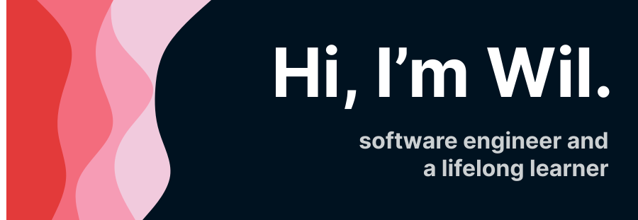

I enjoy reading articles and books relating to tech and always hungry to things and experience that can improve my skills and level up my career.

## Working On
I am currently catching up on latest trends in the web development space. 

## Technologies and Tools

### :fire: I specialize in:

 :sunglasses: Have Experience In:

 
:book: Currently Studying:
 

### :grimacing: Interested In:

## Github Stats

<!---
WilAm1/WilAm1 is a ✨ special ✨ repository because its `README.md` (this file) appears on your GitHub profile.
You can click the Preview link to take a look at your changes.
--->
